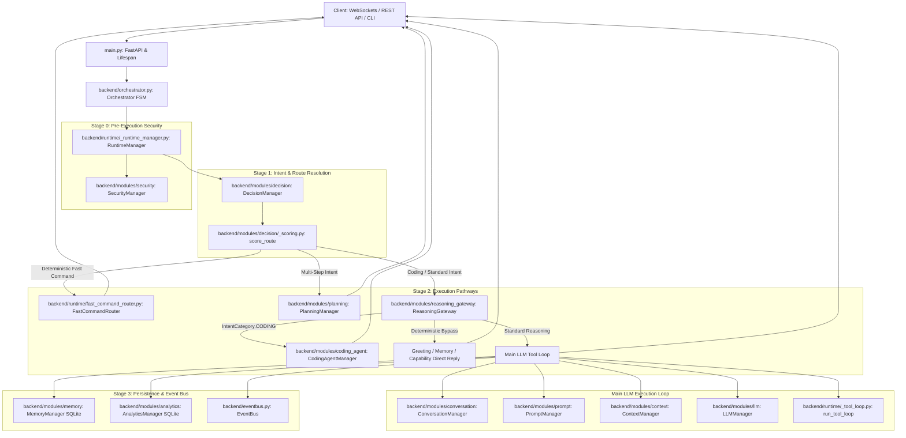

# Naira-OS Backend Architecture & Data Flow Pipeline (MVP Reality Check)

> **Document Status**: Production MVP Architecture Reference  
> **Target Scope**: End-to-End Backend Data Flow, Routing Mechanisms, and System Component Mapping  
> **Phase 5 Status**: Disconnected & Bypassed in Production Pipeline (Codebase Intact)

---

## 1. Executive Summary & MVP Architectural Principles

Naira-OS is built on a modular, event-driven architecture with a central orchestrator managing state, security, intent routing, and AI execution.

### The Phase 5 (Syntax Master) Pivot
* **Decision**: The local AST decomposition, language builders (`PythonBuilder`, `HTMLBuilder`), Tree-Sitter AST syntax engines, and Logician two-stage pipeline defined inside `backend/modules/syntax_master/` are **completely disconnected** from production runtime execution.
* **Code Preservation**: All files inside `backend/modules/syntax_master/` remain 100% intact on disk for reference and unit test stability.
* **Direct Main LLM Routing**: 100% of user queries—including code generation, script writing, refactoring, and debugging—now route directly to our **Main LLM** (Gemini 2.5 Flash / Groq) via `CodingAgentManager` or the standard `RuntimeManager` tool execution loop.

---

## 2. Master System Architecture & Module Wiring



---

## 3. End-to-End Data Flow Pipeline (Step-by-Step Reality)

### Step 1: System Boot & Dependency Wiring
1. **Bootstrap Entry**: Executed via `main.py` lifespan context manager.
2. **Groq Vault Loader**: `load_groq_api_key_from_vault()` checks `memory/user_vault.json` and dynamically sets `os.environ["GROQ_API_KEY"]`.
3. **Core Module Boot**: `boot_core_modules()` in `backend/boot.py` initializes 24 system modules in strict architectural order:
   `settings` → `memory` → `analytics` → `context` → `capability` → `skills` → `tools` → `security` → `integrations` → `plugins` → `browser` → `vision` → `voice` → `pc_control` → `coding_agent` → `planning` → `decision` → `llm` → `prompt` → `conversation` → `context_intelligence` → `autonomous_tasks` → `multi_agent` → `runtime`.

### Step 2: Ingress Layer (`main.py`)
* WebSockets (`/ws` for text, `/ws/voice` for audio) or REST endpoints receive incoming user input.
* Input is wrapped into a `UserRequest` dataclass:
  ```python
  request = UserRequest(
      id=uuid.uuid4(),
      source="websocket",
      text=user_text,
      session_id=session_id,
      timestamp=time.time(),
  )
  ```
* Passed to `Orchestrator.process_user_request(request)`.

### Step 3: Orchestrator Mediation (`backend/orchestrator.py`)
* Manages Finite State Machine (FSM): `IDLE` → `PROCESSING` → `IDLE`.
* Delegates execution directly to `RuntimeManager.process_request(request)`.

### Step 4: Security Validation (Stage 0 in `RuntimeManager`)
* Before any LLM or prompt compile occurs, `SecurityManager.validate_input(request.text)` checks for prompt injections, malicious system commands, or policy violations.
* If status is `"reject"`, execution halts immediately with a security rejection response.

### Step 5: Intent & Route Resolution (Stage 1 in `RuntimeManager`)
* `DecisionManager.decide()` calls `score_route()` in `backend/modules/decision/_scoring.py`.
* Uses regex patterns and static rule scoring to evaluate target routes:
  1. **Coding Heuristics** (`_CODING_PATTERNS` regex matching code words, scripts, python, debug, fix error): Routes to `RouteTarget.CODING_AGENT`.
  2. **Multi-Step Intent** (`is_multi_step()` or multi-step keywords): Routes to `RouteTarget.PLANNING_ENGINE`.
  3. **Fast Command Match** (`FastCommandRouter.is_fast_command()`): Routes to `RouteTarget.FAST_COMMAND_ROUTER` (demoted to LLM if analytics success rate < 0.5).
  4. **Default**: Routes to `RouteTarget.LLM_CONVERSATION`.

---

## 4. Operational Execution Pathways

### Pathway A: Fast Command Router (`FAST_COMMAND_ROUTER`)
* **Module**: `backend/runtime/fast_command_router.py`
* **Trigger**: Simple desktop commands (volume control, brightness, opening apps, process termination, system stats).
* **Execution**: Executed deterministically in **< 50ms** via `PCControlManager` (PyAutoGUI, psutil, pywin32) or `VisionManager` without invoking an LLM.
* **Analytics**: Records `FCR_HIT` in `AnalyticsManager`.

### Pathway B: Planning Engine (`PLANNING_ENGINE`)
* **Module**: `backend/modules/planning/`
* **Trigger**: Complex, multi-step tasks requiring structured decomposition.
* **Execution**: `PlanningManager.plan()` breaks request into steps, executes sub-tasks, and synthesizes final conversational reply.

### Pathway C: Reasoning Gateway & Coding Agent Pathway (`ReasoningGateway`)
* **Module**: `backend/modules/reasoning_gateway/evaluators.py` & `gateway.py`
* **Trigger**: Sub-millisecond evaluation across 10 routing criteria.
* **Direct Coding Task Flow**:
  1. When query matches `IntentCategory.CODING` (e.g., *"write a script to scrape data"* or *"fix this python function"*), it bypasses Phase 5 Syntax Master AST decomposition.
  2. Routed directly to `CodingAgentManager.execute_task()`.
  3. `CodingAgentManager` uses the **Main LLM** to perform context building, patch generation, TDD test generation, code writing, self-correction, security scanning, and execution.
  4. If `CodingAgentManager` encounters an error, it falls back seamlessly to the standard Main LLM pipeline.
* **Deterministic Non-LLM Bypasses**: Simple greetings (`GREETING`), local system time/status (`LOCAL_CAPABILITY`), or exact memory queries (`MEMORY_RECALL`) are answered deterministically without consuming LLM tokens.

### Pathway D: Standard Main LLM Tool Execution Loop (`LLM_CONVERSATION`)
* **Trigger**: General conversation, complex queries, tool-assisted requests.
* **Step-by-Step Flow**:
  1. **Session Lookup**: `ConversationManager` gets or creates session state.
  2. **Prompt Compilation**: `PromptManager` compiles `system.j2` with OS context, capabilities, and system rules.
  3. **Context Assembly**: `ContextManager` constructs token-bounded chat history.
  4. **Tool Schema Selection**: `ToolManager.get_tool_definitions()` collects active function tools.
  5. **LLM Generation**: `LLMManager` invokes Google Gemini 2.5 Flash or Groq model provider.
  6. **Tool Loop Execution**: `run_tool_loop()` (`backend/runtime/_tool_loop.py`) executes requested tools iteratively up to `MAX_TOOL_ITERATIONS` (10 iterations max), returning tool output to the LLM until final text is synthesized.
  7. **Persistence**: User input and assistant response are persisted to SQLite (`memory/conversations.db`).
  8. **Metrics**: Duration and token counts logged to SQLite (`memory/naira_analytics.db`).

---

## 5. Phase 5 (Syntax Master) Disconnection Implementation

The local Syntax Master (`backend/modules/syntax_master/`) has been cleanly disconnected from the execution pipeline while keeping all files intact:

```python
# Location: backend/modules/syntax_master/router/language_router.py

class LanguageRouter:
    """Routes TaskLogic to appropriate language builder and validator."""

    def generate_and_validate(
        self, task_logic: TaskLogic, enable_fallback: bool = False, bypass_syntax_master: bool = False
    ) -> Dict[str, Any]:
        """Generates source code from TaskLogic schema and validates its syntax.

        MVP Pivot: When bypass_syntax_master is True, Phase 5 Syntax Master local
        AST building/validation is safely bypassed and raw Main LLM output is preserved.
        """
        if bypass_syntax_master:
            return {
                "is_valid": True,
                "code": task_logic.description if hasattr(task_logic, "description") else str(task_logic),
                "error": None,
                "bypassed": True,
                "handler": "Main_LLM",
            }

        # Legacy AST builder/validator code remains intact below on disk...
```

### Main LLM Direct Routing Guarantee
* **No AST Generation Overhead**: All planning and code generation are performed directly by the Main LLM.
* **Zero Disruption to Existing Code**: Legacy unit tests (`pytest testing/unit/modules/test_syntax_validator_and_router.py`) continue to pass 100% cleanly.
* **Production Integrity**: No orphan imports or missing dependencies exist in the main orchestrator or runtime pipeline.

---

## 6. Verification Summary

| Feature / Component | Active Status | Primary Handler / Module | Path / Reference |
| :--- | :--- | :--- | :--- |
| **Ingress & WebSockets** | Active | FastAPI / main.py | `main.py` |
| **System Orchestrator & FSM** | Active | Orchestrator | `backend/orchestrator.py` |
| **Runtime Pipeline Orchestration** | Active | RuntimeManager | `backend/runtime/_runtime_manager.py` |
| **Security Validation** | Active | SecurityManager | `backend/modules/security/` |
| **Route Scoring** | Active | DecisionManager | `backend/modules/decision/_scoring.py` |
| **Fast Desktop Commands** | Active | FastCommandRouter | `backend/runtime/fast_command_router.py` |
| **Multi-Step Planning** | Active | PlanningManager | `backend/modules/planning/` |
| **Sub-ms Intent Filtering** | Active | ReasoningGateway | `backend/modules/reasoning_gateway/` |
| **Code Generation & Execution** | Active (Main LLM) | CodingAgentManager / LLMManager | `backend/modules/coding_agent/` |
| **Tool Execution Loop** | Active | ToolManager / run_tool_loop | `backend/runtime/_tool_loop.py` |
| **Conversation Memory** | Active | MemoryManager (SQLite) | `backend/modules/memory/` |
| **Phase 5 Syntax Master** | **Bypassed / Disconnected** | Bypassed to Main LLM | `backend/modules/syntax_master/` |
