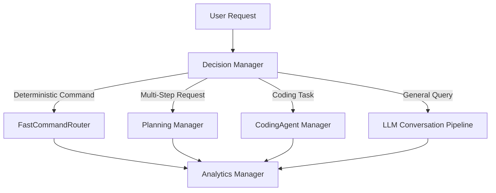

# 22. Execution & Logic Layer Specification

This document defines the architecture, public APIs, and routing flow for the **Execution & Logic Layer** (Layer 4/5) inside **Naira-OS**.

---

## 1. Subsystem Overview

The Execution & Logic Layer consists of three core engines that sit between the Presentation/Interface layer and lower-level tool execution / LLM providers:

---

## 2. Analytics Engine (`backend/modules/analytics/`)

### Purpose
Passively track tool calls, execution durations, command success rates, and Fast Command Router (FCR) hit vs. LLM fallback effectiveness.

### Storage & Architecture
- **In-Memory Rolling Aggregator (`AnalyticsAggregator`)**: Zero-latency queries for `today`, `last 7 days`, and `all-time` statistics.
- **SQLite Store (`SQLiteAnalyticsStore`)**: WAL-mode enabled database (`PRAGMA journal_mode=WAL;`). All DB writes are non-blocking via `asyncio.to_thread`.
- Fallbacks to SQL `GROUP BY` only for historical queries older than 7 days.

### Public API (`AnalyticsManager`)
| Method | Return Type | Description |
|---|---|---|
| `record(event: AnalyticsEvent)` | `None` | Non-blocking fire-and-forget event recorder. |
| `get_summary(period: "today" \| "week" \| "all")` | `AnalyticsSummary` | Returns total event counts, success rate, top 5 tools, avg latency. |
| `get_fcr_effectiveness()` | `float` | Returns % of commands resolved by FCR vs LLM fallback. |
| `get_intent_success_rate(pattern: str)` | `float` | Returns historical success rate for a given intent or tool pattern. |

---

## 3. Planning Engine (`backend/modules/planning/`)

### Purpose
Decomposes complex multi-step user requests into an ordered task graph before execution.

### Architecture & Swappable Strategy
- Uses abstract `PlannerPort` protocol (`backend/modules/planning/ports/planner_port.py`).
- **Phase-1 Provider (`RuleBasedPlannerProvider`)**: Pattern matches multi-step connectives ("and then", "phir", "uske baad") and reuses FCR normalizers (`WakeWordCleaner`, `MultilingualNormalizer`).
- **Executor Bridge (`PlanExecutorBridge`)**: Step-by-step execution walker respecting step dependency ordering (`depends_on`), verifying security policy permissions per step.

### Public API (`PlanningManager`)
| Method | Return Type | Description |
|---|---|---|
| `is_multi_step(request: str)` | `bool` | Cheap heuristic gate checking word count and connectives (no LLM call). |
| `plan(request: str, context: dict)` | `TaskPlan` | Decomposes user request into structured `TaskStep` list. |
| `execute_plan(plan: TaskPlan)` | `PlanResult` | Executes plan step-by-step; stops upon step failure and reports status. |

---

## 4. Decision Engine / Skill Engine (`backend/modules/decision/`)

### Purpose
Evaluates inbound requests to select the optimal subsystem target (`FAST_COMMAND_ROUTER`, `PLANNING_ENGINE`, `CODING_AGENT`, `LLM_CONVERSATION`).

### Pure Rule Scoring & Analytics Feedback
1. Checks FCR `is_fast_command()`.
2. Checks Analytics feedback: demotes FCR route to `LLM_CONVERSATION` if historical success rate for the intent pattern falls below 50%.
3. Checks Planning Engine `is_multi_step()`.
4. Checks Coding Agent domain capability patterns.
5. Default fallback: `LLM_CONVERSATION`.
6. Graceful degradation: If AnalyticsManager is `None` or `degraded`, falls back to static rule ordering (FCR > Planning > LLM).

### Public API (`DecisionManager`)
| Method | Return Type | Description |
|---|---|---|
| `decide(request: str, context: dict)` | `RouteDecision` | Returns `target` (`RouteTarget`), `confidence`, and `reason`. |

---

## 5. Lifecycle & Boot Integration

Registered in `backend/boot.py` following system architecture order:
1. `AnalyticsManager` (booted early after memory store).
2. `PlanningManager` (booted after tool/security managers).
3. `DecisionManager` (booted after analytics and planning, injected into `RuntimeManager`).
