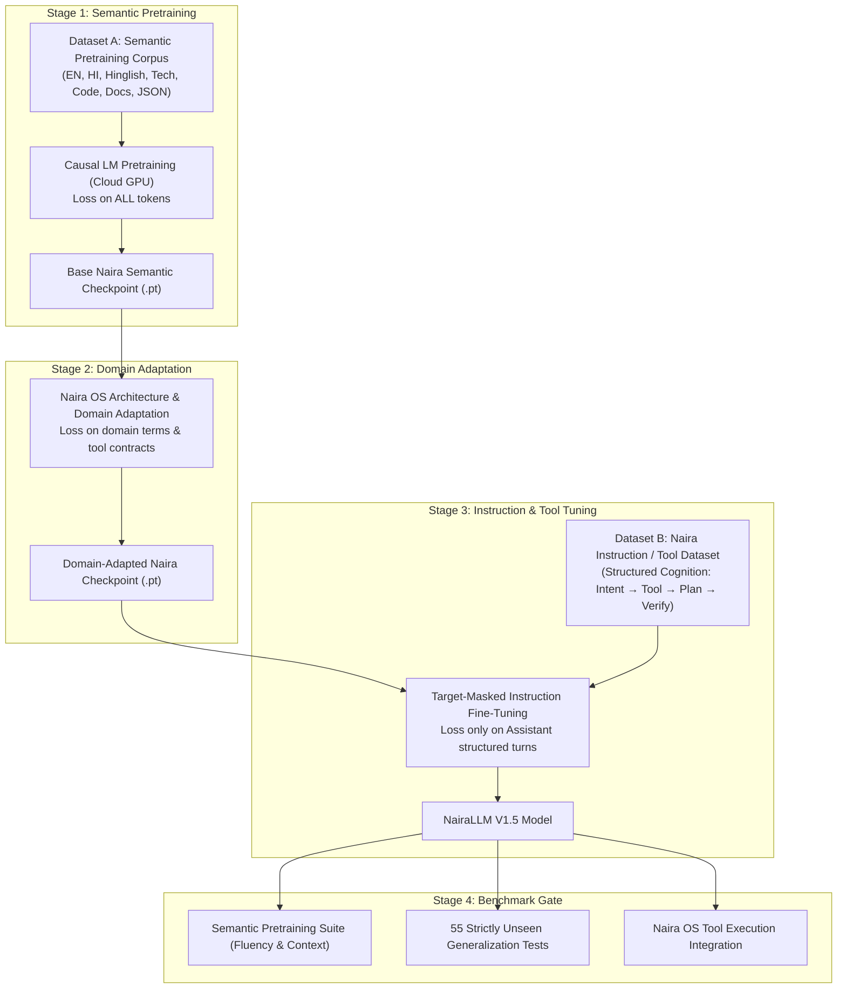

# NairaLLM V1.5 — Semantic Pretraining Plan

## 1. Context & Rationale
Previous experiments (V1.0 through V1.4) demonstrated that raw parameter capacity scaling (1.43M to 7.06M) on purely instruction/tool-call datasets without an underlying natural language representation does not yield zero-shot semantic generalization. The model must acquire a general multilingual semantic and syntactic foundation before instruction tuning.

This document defines the **Semantic Foundation Pretraining Architecture** for training on free cloud GPU resources (Google Colab, Kaggle Notebooks) with complete provenance traceability.

---

## 2. Core Specification Matrix

| Dimension | Specification | Implementation Rationale |
| :--- | :--- | :--- |
| **1. Pretraining Objective** | Standard Causal Language Modeling (Next-Token Cross-Entropy Loss: $\mathcal{L} = -\sum \log P(x_t \mid x_{<t})$) | Proven foundation for autoregressive decoder-only architectures; learns universal language transitions without supervision. |
| **2. Corpus Format** | Canonical JSONL (`{"text": "...", "domain": "...", "language": "...", "provenance_id": "..."}`) | Standard, streaming-friendly, verifiable, easily packable and inspectable. |
| **3. Tokenization** | Byte-Level BPE (2,048 / 4,096 vocab) with stable control token IDs | Single-token representation for English, Devanagari Hindi, Hinglish, Code, JSON, and control delimiters. |
| **4. Sequence Construction** | Contiguous text streams separated by `<|endoftext|>` | Teaches multi-document context transitions and boundary recognition. |
| **5. Dataset Packing** | Continuous token packing into fixed-length blocks (no zero-padding waste) | Maximizes computational throughput on GPU; 100% token utilization per FLOP. |
| **6. Context Length** | 512 tokens (Prototype Phase) $\to$ 1,024 tokens (Base Scale) | Balances attention quadratic memory footprint on 15GB/16GB free cloud VRAM with multi-turn coherence. |
| **7. Training Split** | 90% Training Split | Ample variety for self-supervised token prediction. |
| **8. Validation Split** | 10% Validation Split | Evaluates validation perplexity and prevents overfitting on specific domains. |
| **9. Checkpointing** | PyTorch state dictionary (`.pt`) + optimizer + scheduler + step + metadata JSON | Complete state capture enabling exact session resumption and weights export. |
| **10. GPU Training Engine** | PyTorch CUDA with Automatic Mixed Precision (`torch.cuda.amp.autocast`) & Gradient Accumulation | Fast execution on T4/P100/L4 GPUs with variable VRAM; handles low-memory constraints gracefully. |
| **11. Resume Strategy** | Automatic latest checkpoint discovery, RNG state reload, step/epoch alignment | Essential for free cloud tiers where sessions can disconnect without notice. |
| **12. Evaluation Suite** | Dual benchmark: Semantic Foundation Suite (Comprehension/Continuation) + Exact 55 Unseen Naira Tests | Evaluates general language fluency separately from OS tool execution. |
| **13. Corpus Provenance** | Strict provenance ledger in `dataset/provenance/` recording source, license, and acquisition method | Zero undocumented synthetic outputs from closed proprietary models; zero unlicensed web scraping. |
| **14. Data Licensing Rules** | Public Domain, MIT, Apache 2.0, CC-BY, and human/project-authored text only | Complete legal and architectural sovereignty for the self-owned Naira model. |

---

## 3. Two-Dataset Sequential Training Hierarchy

---

## 4. Cloud Environment & Checkpoint Recovery

1. **Local Machine (Control & Dev)**:
   - Houses code, dataset generation, tokenizer training, environment verification scripts, and unit tests.
   - Evaluates downloaded checkpoints and runs regression gates.

2. **Free Cloud GPU (Execution)**:
   - Google Colab / Kaggle Notebooks dynamically detected.
   - Saves checkpoint files periodically (e.g. every 500 steps / each epoch) to persistent storage (`/content/drive` on Colab or downloadable archive on Kaggle).
   - Any interrupted run resumes from the latest checkpoint without restarting from step 0.

3. **Validation Threshold**:
   - Semantic validation loss $\le 2.2$ (Perplexity $\le 9.0$).
   - Generalization on 55 unseen tests significantly improving beyond V1.2 (6/55) baseline.
